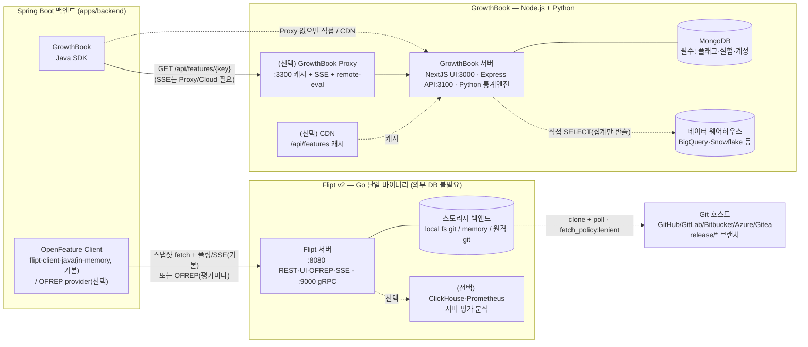
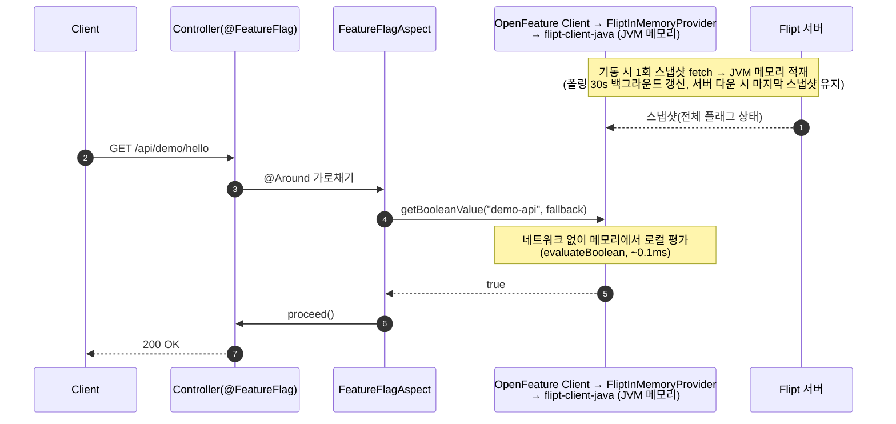
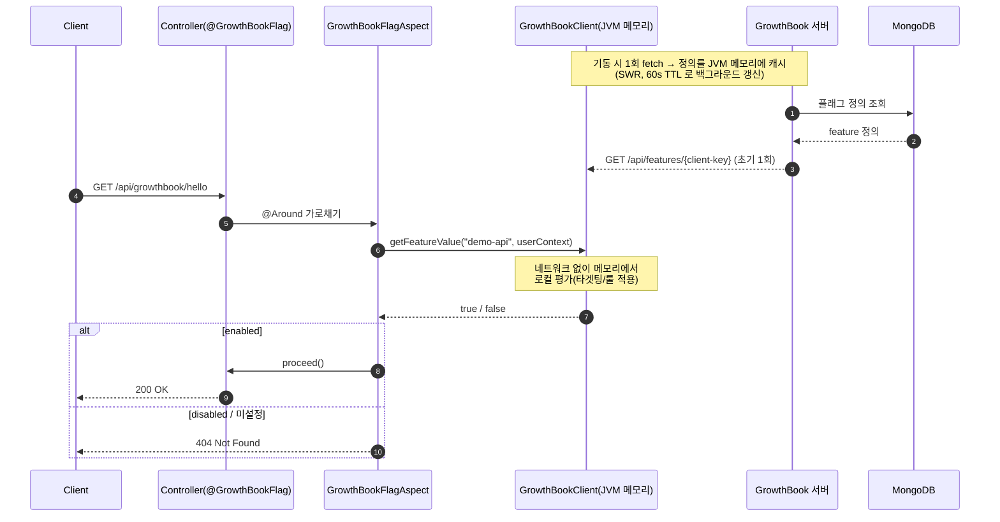
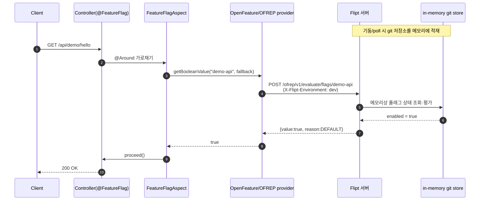
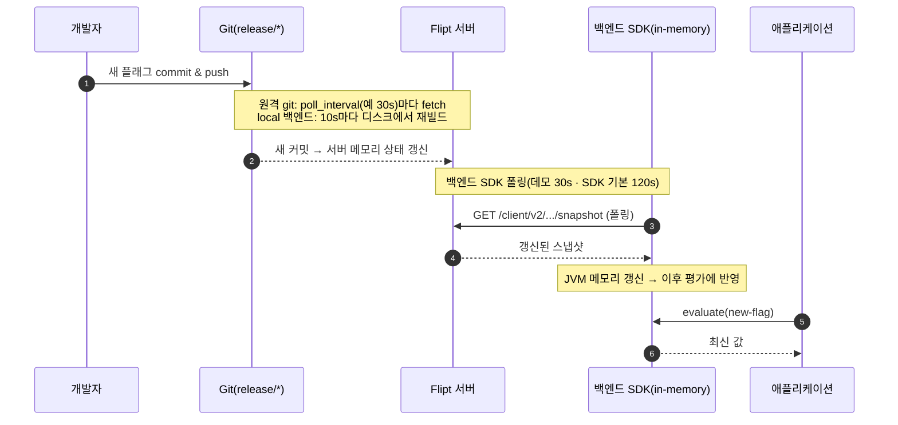
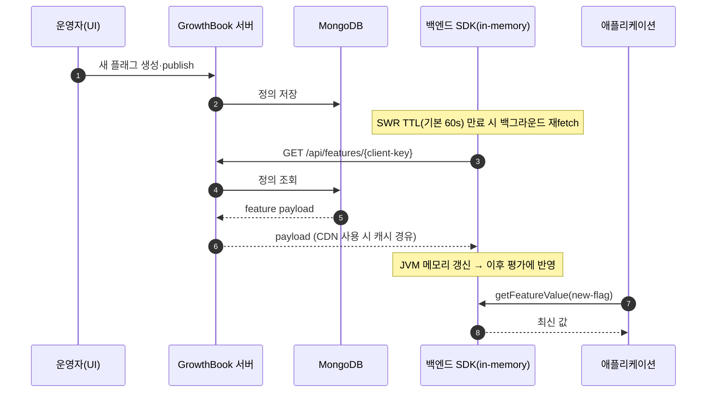
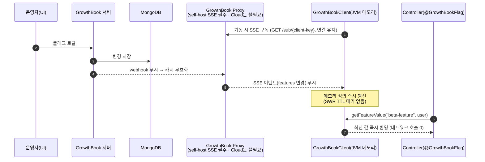
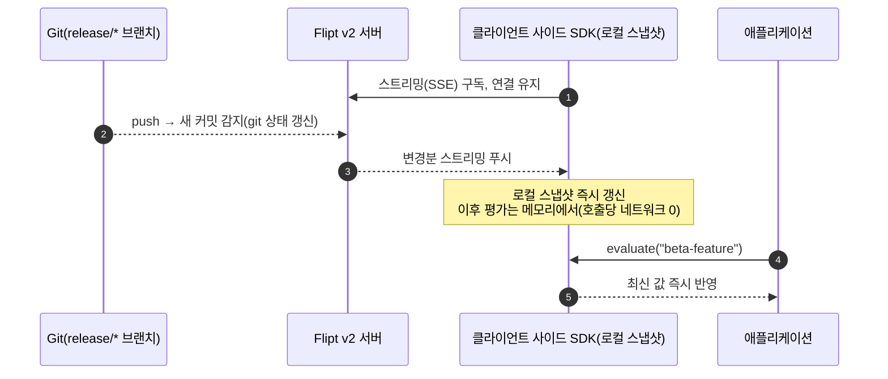

# Flipt vs GrowthBook 비교

이 문서는 본 레포(`flipt-demo`)에서 **같은 Spring Boot 백엔드**에 두 피처 플래그 솔루션을
나란히 붙여 비교한 결과를 정리한 것입니다. 동일한 플래그 키(`demo-api`, `beta-feature`)를
- **Flipt v2** — OpenFeature `Client`로 평가. **기본 in-memory(`flipt-client-java`)**, `flipt.mode=ofrep`로 OFREP 전환 가능 (`/api/demo/*`)
- **GrowthBook** — 네이티브 Java SDK 로 평가 (`/api/growthbook/*`)

로 1:1 대응시켜 운영 인프라·기능·실제 동작을 비교합니다.

> 검증 환경: Flipt `v2`, GrowthBook `growthbook/growthbook:latest`(+ MongoDB 7),
> 백엔드 Spring Boot 3.5.x / Java 25, OpenFeature SDK 1.20.2,
> Flipt 평가 = `flipt-client-java` 1.3.1(in-memory, 기본) / OFREP provider 0.0.1(선택),
> growthbook-sdk-java 0.10.6. (검증일: 2026-05-27)

## 한눈에 보기

| 항목 | Flipt v2 | GrowthBook |
| --- | --- | --- |
| 핵심 포지셔닝 | Git-native 피처 플래그 관리 | 피처 플래그 + 실험(A/B) + 제품 분석 |
| 상태 저장소 | **Git** (로컬/원격 브랜치, DB 불필요) | **MongoDB** (필수) |
| 형상 관리(SSOT) | git 선언형 YAML (GitOps 네이티브) | UI → MongoDB (git 연동 없음) |
| 평가 위치(본 데모 연동) | **클라이언트 사이드 in-memory**(기본, `flipt-client-java`) · OFREP(서버 사이드)도 `flipt.mode`로 선택 | **클라이언트 사이드** (SDK가 JVM 메모리에서 평가) |
| 지원 평가 모델 | 서버 사이드(REST/gRPC/OFREP) **+ 클라이언트 사이드 in-memory**(Java 등 client-side SDK) | 서버 사이드(remote eval) **+ 클라이언트 사이드 in-memory**(네이티브 SDK) |
| 표준 프로토콜 | OpenFeature / OFREP 지원 | 네이티브 SDK 중심(24종) |
| 실험/통계 엔진 | 없음(플래그 관리에 집중) | 강력(Bayesian/Sequential/CUPED/Bandit 등) |
| 서버 런타임 | Go 단일 바이너리(외부 DB 불필요) | NextJS+Express+Python(+MongoDB 필수, 선택 Proxy/CDN) |
| 라이선스/과금 | OSS(코어) + **Pro(인스턴스 정액)** | OSS(MIT) + **Pro(시트당)/Enterprise(커스텀)** |
| 초기 셋업 난이도 | 낮음(파일만 있으면 바로 평가) | 중간(계정·Feature·SDK Connection·키 발급 필요) |

---

# 운영 인프라

## 의존 구성도 (component diagram)

두 솔루션의 서빙 컴포넌트와 의존 관계입니다 — 한눈에 **Flipt=git 기반 단일 바이너리**,
**GrowthBook=MongoDB 중심 다중 컴포넌트**. 각 요소의 역할/대안은 바로 아래 "서빙/배포 아키텍처" 표에
정리합니다.



## 서빙/배포 아키텍처 비교

"무엇을 띄워 어떻게 운영하는가"의 차이입니다. 각 행이 위 다이어그램의 컴포넌트에 대응합니다.

| 항목 | Flipt v2 | GrowthBook |
| --- | --- | --- |
| 서버 런타임 | **Go 단일 바이너리** | **NextJS(UI)+Express(API)+Python(통계)** — 단일 이미지 번들, 분리 가능 |
| 필수 데이터스토어 | **없음**(git/디스크가 상태) | **MongoDB**(DocumentDB/CosmosDB/Atlas 호환) |
| 스토리지/소스 | local fs git · memory · 원격 git sync(GitHub·GitLab·Bitbucket·Azure DevOps·Gitea) | MongoDB 단일 |
| 선택 구성요소 | ClickHouse·Prometheus(분석), Redis(분산 세션) | **GrowthBook Proxy**(:3300, 캐시+SSE+remote-eval), Redis(Proxy 분산캐시), CDN |
| 상태/확장(HA) | 사실상 stateless(상태=git) → replica 다중 + PV/백업 | stateless 컨테이너 LB 수평확장(**최소 3 권장**, 2GB/1vCPU↑), 통계 부하 시 **Jobs 서버 분리** |
| 노출 포트 | 8080(REST/UI/OFREP/SSE/metrics), 9000(gRPC) | 3000(UI), 3100(API), (Proxy) 3300 |
| 데이터 웨어하우스 | — | 서버가 **직접 SELECT**, 집계만 반출(BigQuery/Snowflake/Redshift/ClickHouse 등 12+) |
| 실시간 서빙 보조 | 클라이언트 SDK의 **in-memory 로컬 평가**(Rust 엔진 — Java는 FFI, JS는 WASM)가 엣지 역할(서버 부하 분산) | **GrowthBook Proxy + CDN**(SSE 중계·payload 캐시) |
| 배포 | Docker(`docker.flipt.io/flipt/flipt:v2`), Helm `flipt-v2`, 바이너리(`get.flipt.io/v2`) | Docker / docker-compose / 공식 Helm chart |
| 관리형 SaaS | Flipt Cloud(데이터는 사용자 git org의 private repo에 잔류) | GrowthBook Cloud(apiHost 기본 `cdn.growthbook.io`) |

> **왜 GrowthBook은 별도 Proxy를 두나** — 메인 서버(NextJS UI + Express API + MongoDB)는 *플래그를
> 만들고 저장하는 관리 콘솔*이지, 다수 SDK에 고속·실시간으로 payload를 뿌리는 **배포(엣지) 레이어가
> 아닙니다.** 그 역할을 분리한 것이 Proxy이며, 아래가 필요할 때 둡니다(없으면 SDK가 폴링/CDN으로 직접
> 가져옴 — 이 데모는 폴링이라 Proxy 불필요):
> - **실시간(SSE)** — 메인 서버는 SDK에 SSE를 직접 푸시하지 않음. 변경 시 GrowthBook이 **Proxy로
>   webhook** → Proxy가 캐시를 무효화하고 SDK에 SSE 푸시. 그래서 **self-host의 SSE는 Proxy가 필수**
>   (Cloud는 GrowthBook이 동일 인프라를 대신 운영).
> - **캐싱/확장** — payload를 메모리(+선택 Redis)에 캐시해 많은 SDK에 싸게 서빙 → 메인 API·MongoDB
>   부하를 분리(고동시성 대응).
> - **Remote Evaluation** — 신뢰할 수 없는 클라이언트(브라우저/모바일)에 룰·정의를 노출하지 않고
>   Proxy에서 평가만 수행.
> - **보안/동시성** — private-key 인증, 대규모 동시 연결 처리.
>
> 대비: **Flipt는 SSE가 서버에 내장**되어 추가 컴포넌트 없이 `flipt.sync-mode=streaming` 한 줄이면
> 됩니다(출처: [GrowthBook Proxy](https://docs.growthbook.io/self-host/proxy)).

## API 요청 시 in-memory 평가 처리 과정 (sequence diagram)

이 데모는 **Flipt·GrowthBook 둘 다 클라이언트 사이드 in-memory 평가**입니다. 아래 3개 다이어그램은
**Flipt in-memory(기본)** · **GrowthBook** · **Flipt OFREP(`flipt.mode=ofrep` 대안)** 순서입니다.

> 플래그 *변경*이 백엔드까지 **전파**되는 과정(폴링·SSE)은 아래 "플래그 추가/변경 → 백엔드 전파
> 시나리오" 절에서 다룹니다.

### Flipt (기본) — 클라이언트 사이드 in-memory 평가 (스냅샷 fetch 후 JVM 메모리에서 로컬 평가)



### GrowthBook — 클라이언트 사이드 평가 (SDK가 정의를 JVM 메모리에 캐시 후 로컬 평가)



### Flipt (선택) — OFREP 서버 사이드 평가 (`flipt.mode=ofrep`)

`flipt.mode=ofrep`로 전환하면 OpenFeature OFREP provider가 평가마다 Flipt 서버를 호출합니다.
in-memory 모드와 **동일한 `@FeatureFlag`/OpenFeature `Client`** 를 쓰고 provider만 교체됩니다.



**요지** — 세 경로 모두 같은 `@FeatureFlag`/OpenFeature `Client`를 사용합니다(provider만 교체).
- **in-memory**(Flipt 기본 · GrowthBook): 스냅샷/정의를 받아 **JVM 메모리에서 로컬 평가** → 호출당 네트워크 0, ~0.1ms.
- **Flipt OFREP**(`flipt.mode=ofrep`): 평가마다 서버 호출 → 최신성↑, OpenFeature 표준 그대로.

> 📌 두 솔루션 모두 *서버 사이드 + 클라이언트 사이드 in-memory* 를 지원합니다. 이 데모는 Flipt를
> in-memory(`flipt-client-java`)로 통합 구현하되 OpenFeature 추상화(`FliptInMemoryProvider`)를 유지해
> `flipt.mode` 한 줄로 두 평가 모델을 오갑니다.

**in-memory 평가 시나리오 — 추가로 짚을 엣지케이스**

위 행복 경로 외에, in-memory 평가를 운영할 때 고려할 지점들입니다(데모 코드의 실제 동작 포함).

| 상황 | Flipt(`flipt-client-java`) | GrowthBook(Java SDK) | 데모의 처리 |
| --- | --- | --- | --- |
| **콜드 스타트**(스냅샷 도착 전) | `build()`가 동기 fetch → 완료 후 ready | `init()` 동기 fetch | 둘 다 부팅 시 1회 동기 로딩, 도착 전 평가 없음 |
| **부팅 시 서버 불가** | `build()` 예외 → 클라이언트 미초기화 | 정의 미적재 | **fallback(annotation 기본값) 반환**, 부팅은 지속(fail-safe) |
| **갱신 지연(stale 창)** | 폴링 주기(데모 30s, SDK 기본 120s) 동안 옛 값 | SWR TTL(기본 60s) 동안 옛 값 | 즉시성 필요하면 SSE/짧은 주기로 |
| **서버 다운 중 평가** | 마지막 스냅샷으로 계속 평가 | 마지막 캐시로 계속 평가 | 평가 지속(폴링만 실패) — 테스트 결과 (b) 참고 |
| **타겟팅/세그먼트 컨텍스트** | `evaluateBoolean(key, entityId, ctx)` 필요 | `getFeatureValue(key, attrs)` 필요 | boolean 데모라 고정 `entityId`/속성 사용 |
| **오프라인 부팅(스냅샷 시딩)** | `getSnapshot()` base64 스냅샷으로 seed 가능 | 캐시/파일 시딩 | 데모 미사용(필요 시 도입 가능) |
| **메모리/리소스** | Rust 엔진 + 스냅샷이 프로세스 메모리 점유 | 정의 캐시가 메모리 점유 | 플래그 수가 많으면 스냅샷 크기 고려 |

## 플래그 추가/변경 → 백엔드 전파 시나리오

위 다이어그램이 "이미 적재된 플래그를 **평가**하는 과정"이라면, 여기서는 **새 플래그를 추가/토글했을
때 그 변경이 백엔드(클라이언트) 메모리까지 도달하는 과정**을 다룹니다. 두 솔루션 모두 **전파 경로가
"중앙 저장 → 클라이언트 동기화" 2단계**이며, 동기화 방식이 폴링(현재 데모)이냐 SSE냐로 갈립니다.

### 현재 구성 — 폴링 전파

**Flipt — git 커밋 → 서버 반영 → 백엔드 SDK 폴링**



> 최악 지연 ≈ **(서버 git 반영: 원격 poll ~30s / local 10s) + (백엔드 SDK 폴링 주기)**. 데모는 SDK
> 폴링을 30s로 설정(`flipt.update-interval-seconds`)했고, `flipt-client-java` 기본값은 120s입니다.
> (UI/`local` 환경은 쓰기 시 즉시 git 커밋되므로 서버 반영 단계가 거의 즉시입니다.)

**GrowthBook — UI publish → MongoDB → 백엔드 SDK SWR 폴링**



> 최악 지연 ≈ **SWR TTL(기본 60s) + (CDN 캐시 TTL)**. CDN을 두면 `CACHE_CONTROL_MAX_AGE` 등
> 헤더만큼 추가 지연이 생길 수 있습니다.

### SSE 적용 시 — 실시간 전파 (현재 데모는 폴링, SSE는 미적용)

위 폴링 경로는 **변경 → 반영**에 폴링 주기만큼 지연이 있습니다. 두 솔루션 모두 이 지연을 없애는
**SSE(Server-Sent Events) 푸시 동기화**를 지원합니다 — 백엔드가 서버와 **연결을 유지**하다가
변경이 생기면 **즉시 푸시**받아 메모리 상태를 갱신합니다.

> ⚠️ **본 데모는 SSE를 사용하지 않습니다.** 아래는 두 솔루션이 지원하는 기능/프로덕션 패턴이며,
> 켜는 방법은 각 다이어그램 뒤에 정리했습니다.

**GrowthBook — SDK가 SSE 구독 → 변경 즉시 메모리 갱신 (self-host는 Proxy 경유)**



> **켜는 법(주의)**: SDK는 `refreshStrategy` 를 `SERVER_SENT_EVENTS` 로 바꾸면 되지만, **self-host SSE는
> 별도 GrowthBook Proxy가 필요**합니다(위 ["왜 GrowthBook은 별도 Proxy를 두나"](#서빙배포-아키텍처-비교)
> 참고 · Cloud는 불필요). 공식 Proxy 문서가 SSE를 JS/React 중심으로 안내하므로 백엔드(Java) SSE는 환경
> 검증이 필요합니다.

**Flipt — 클라이언트 사이드 SDK가 스트리밍 구독 → 변경 즉시 스냅샷 갱신**



> **켜는 법(한 줄 변경)**: 본 데모는 이미 Flipt를 client-side SDK(`flipt-client-java`)로 in-memory
> 평가하므로, `flipt.sync-mode=streaming`(→ `FetchMode.STREAMING`)으로 바꾸면 폴링 대신 SSE
> 스트리밍으로 즉시 동기화됩니다. 기본값은 폴링(30s)입니다. (`flipt.mode=ofrep`일 때는 OFREP가
> 요청/응답이라 해당 없음.)

**SSE 도입 시 트레이드오프**

| 측면 | 폴링/요청응답(현재 데모) | SSE 푸시 |
| --- | --- | --- |
| 반영 지연 | poll/TTL 만큼(수십 초) | 사실상 즉시(sub-second) |
| 호출당 네트워크 | Flipt OFREP는 평가마다 발생 | 0(연결 유지 + 메모리 평가) |
| 운영 복잡도 | 낮음(상태 비유지) | 연결 유지·재연결·프록시/LB의 SSE 지원 고려 필요 |
| 추가 인프라 | 불필요 | **Flipt**: 추가 컴포넌트 없음(서버 내장 SSE). **GrowthBook self-host**: GrowthBook Proxy 필요(Cloud는 불필요) |
| 적합 상황 | 단순/소규모, 지연 허용 | 즉시 롤아웃/킬스위치가 중요한 운영 |

---

# 지원하는 기능 및 장단점

## 기능 비교

| 기능 | Flipt v2 | GrowthBook |
| --- | --- | --- |
| Boolean / Multivariate 플래그 | ✅ | ✅ |
| 세그먼트/타겟팅 룰 | ✅ | ✅ (속성 기반 타겟팅 풍부) |
| 퍼센트 롤아웃(점진 배포) | ✅ | ✅ |
| A/B 테스트·실험 | ❌ (플래그 관리 집중) | ✅ (원클릭으로 플래그→실험) |
| 통계 엔진 | ❌ | ✅ Bayesian/Sequential/CUPED/Bandit/SRM |
| 제품 분석 | ❌ | ✅ |
| OpenFeature 표준 | ✅ (OFREP 네이티브) | △ (provider 별도) |
| SDK | 다수 + OFREP로 표준화 | 24종(React/Python/iOS/Android/Java 등) |
| GitOps / 선언형 config | ✅ **네이티브(git이 SSOT)** | ❌ (UI→MongoDB) |
| 감사 로그/변경 이력 | ✅ git 히스토리 그대로(+Pro audit) | ✅ 앱 내 audit log |
| 승급(promotion) 워크플로 | ✅ 브랜치 승급(dev→staging→prod) | △ 환경별 관리(별도) |
| 외부 DB 필요 | ❌ | ✅ MongoDB |
| 실시간 갱신 | ✅ SSE 스트리밍(OSS, 서버 내장) / poll | ✅ SSE(self-host는 **Proxy 필요**) / SWR |
| 데이터 웨어하우스 연동 | ❌ | ✅ (실험 분석용) |

## Admin · 거버넌스 기능 비교

위 표가 "플래그 평가/배포" 기능이라면, 여기서는 **운영 콘솔에서 제공하는 관리·거버넌스 기능**을
망라해 비교합니다. 무료/유료 경계가 제품 선택에 크게 작용하므로 **OSS(무료) / Pro / Enterprise** 티어를
함께 표기합니다(티어는 변동 가능 — 출처: [Flipt 라이선싱](https://docs.flipt.io/v2/licensing)·[Pro](https://docs.flipt.io/v2/pro),
[GrowthBook 가격](https://www.growthbook.io/pricing)).

> 과금 모델이 다릅니다 — **Flipt**: OSS 무료 + **Pro 인스턴스 정액**(약 $200/월·$2,000/년).
> **GrowthBook**: OSS(self-host) 무료 + **Pro 시트당**(Cloud 약 $40/seat·월) + **Enterprise(커스텀)**.

### 관리 UI(콘솔)

둘 다 **내장 웹 콘솔**을 제공합니다(별도 설치 불필요). 단 **관리 모델이 대조적**입니다 — GrowthBook은
*UI가 곧 단일 관리 표면*(모든 변경 UI→MongoDB)인 반면, Flipt는 *UI는 편집·조회용이고 운영 환경의 변경은
git(GitOps)* 으로 흐릅니다.

| UI 기능 | Flipt v2 | GrowthBook |
| --- | --- | --- |
| 내장 관리 UI | ✅ 서버 내장(:8080), OSS | ✅ NextJS 앱(:3000), OSS |
| 플래그/세그먼트/룰/롤아웃 편집 | ✅ | ✅ |
| **UI 쓰기 경계** | `local`만 쓰기 · **원격 git 환경은 읽기전용**(변경은 push/GitOps) | **전면 UI 쓰기**(모든 변경이 UI→MongoDB) |
| 감사 로그 뷰 | git 히스토리(`git log`/호스트 UI, 앱 외부) | **앱 내 audit log 뷰** |
| 실험 결과 대시보드 | — | ✅ 통계·그래프 대시보드 |
| 제품/메트릭 분석 뷰 | 평가 카운트만(ClickHouse/Prometheus 설정 시) | ✅ 내장 메트릭/분석 |
| 사용자·역할 관리 | 주로 IdP+OPA 정책(파일/config) | ✅ UI에서 사용자·역할·팀 관리 |
| SDK 연결/키 관리 | 토큰 생성(UI/API) | ✅ SDK Connection UI |

> 요약: **Flipt UI ≈ "플래그 편집기 + git 뷰어"**(운영 환경은 GitOps로 게이팅), **GrowthBook UI ≈
> "올인원 관리·실험·분석 콘솔"**(비개발 직군 친화). 이 차이가 *누가 플래그를 바꾸는가* — 엔지니어의
> git PR이냐 PM/운영자의 UI 토글이냐 — 를 가릅니다.

### 인증 · 접근제어(IAM)

| 기능 | Flipt v2 | GrowthBook |
| --- | --- | --- |
| 로그인/인증 방식 | Static Token · **OIDC** · GitHub OAuth · Kubernetes · JWT (OSS) | 이메일/비밀번호 로그인 (OSS) |
| RBAC/역할 | **OPA(Rego) 정책** 기반, global/environment/namespace 스코프, 역할은 데이터로 정의 (OSS) | 표준 역할 8종 (OSS) · 프로젝트/환경별 권한 (Pro) · **커스텀 역할** (Enterprise) |
| SSO (SAML/OIDC) | OIDC/OAuth (OSS) · 엔터프라이즈 IdP (Pro 예정) | **SSO/SAML** (Enterprise) |
| SCIM 프로비저닝 | 미확인 | **SCIM** (Enterprise) |
| Teams(팀 단위 권한) | namespace/OPA 데이터로 표현 | **Teams** (Enterprise) |
| API/토큰 | client token 생성·관리 (OSS) | API key · SDK Connection key (OSS) |

### 거버넌스 · 변경관리

| 기능 | Flipt v2 | GrowthBook |
| --- | --- | --- |
| 변경 이력/버전 | **git 히스토리**(blame/diff/revert) (OSS) | 기본 audit log·버전 (OSS) · **export 가능 audit** (Enterprise) |
| 감사 이벤트(webhook) | audit 이벤트 webhook(서명 헤더) (OSS) | Event/SDK webhook (OSS) |
| 변경 승인(approval) | **Merge Proposals**(PR/MR을 UI에서) (**Pro**) | **Approval Flows**(draft & review, 환경별 강제) (**Enterprise**) |
| 커밋 서명/검증 | **GPG commit signing** (**Pro**) | — |
| SCM 연동 | GitHub/GitLab/Bitbucket/Azure DevOps/Gitea (**Pro**) | (git 연동 없음 — UI→MongoDB) |
| Secrets 매니저 | Vault/AWS/GCP/Azure (**Pro**) | 환경변수/`ENCRYPTION_KEY` (OSS) |

### 조직 · 환경 구성

| 기능 | Flipt v2 | GrowthBook |
| --- | --- | --- |
| 환경(environments) | 무제한, **서버 config로만 정의**(UI 생성 불가) (OSS) | dev/staging/prod 등 UI 관리 (OSS) |
| 격리 단위 | **namespaces**(환경 내 팀 격리) (OSS) | **projects**(feature/metric/experiment 묶음) (OSS) |
| 브랜치 | **환경 브랜치를 UI/API로 생성**(독립 복제본) (OSS) | — |
| 멀티테넌시 | env/namespace 격리, Cloud=SaaS 멀티테넌트 | org/projects (self-host 멀티org는 불확실) |

### 플래그 운영 기능

| 기능 | Flipt v2 | GrowthBook |
| --- | --- | --- |
| 플래그 타입 | Boolean · **Variant**(멀티배리언트, ≤1MB JSON attach) (OSS) | Boolean · String · Number · **JSON** (OSS) |
| 타겟팅/세그먼트 | Segment+Constraint(5종), Rule/Distribution (OSS) | attribute 타겟팅 · saved segment (OSS) |
| 퍼센트 롤아웃 | Distribution/Threshold(CRC32 버킷팅) (OSS) | gradual rollout (OSS) |
| 스케줄링(예약 on/off) | 명시 기능 미확인 | **Scheduling** (**Pro**) |
| Prerequisite / kill switch | boolean rollout 조합으로 구현 | **top-level prerequisite**(킬스위치) (**Pro**) · inline prereq (Enterprise) |
| Safe rollout(가드레일+자동 롤백) | — | **Safe Rollout** (**Pro**) |
| JSON 스키마 검증 | — | **Validation** (Enterprise) |
| 아키타입(테스트 프로필) | — | **Archetypes** (**Pro**) |

### 분석 · 실험 · 통합

| 기능 | Flipt v2 | GrowthBook |
| --- | --- | --- |
| 평가 분석 | 서버 평가 카운트 → ClickHouse/Prometheus (OSS) · 고급분석 (Pro 예정) | 내장 **제품 분석 + 실험 분석** |
| 실험/통계 엔진 | — (플래그 전용) | Bayesian/Frequentist · **CUPED/Sequential/Bandit/Sticky bucketing** (Pro) · post-strat/holdout (Enterprise) |
| 알림(Slack 등) | webhook 기반 | **Slack 통합**(이벤트/환경 필터) (OSS) |
| 코드 참조(code refs) | git diff로 추적 | **Code References**(GitHub Action/CLI) (Enterprise) |
| 스테일 플래그 정리 | git diff/PR로 추적 | stale 탐지 (OSS) · code refs 보강 (Enterprise) |

**정리**

- **Flipt**: 인증·RBAC(OPA)·환경/네임스페이스·**SSE 스트리밍**까지 **OSS 무료**. 거버넌스 고급
  (Merge Proposal 승인, GPG 서명, SCM 연동, Secrets 매니저)이 **Pro**. git-native라 변경 이력/감사/롤백이
  도구 없이 git으로 자연 확보됩니다. 다만 **environment 생성은 서버 config 전용**(UI 불가)이라 IaC/운영팀
  주도 모델입니다.
- **GrowthBook**: 플래그 운영·환경·프로젝트·웹훅·Slack·실험까지 **OSS 무료** 폭이 넓지만, **엔터프라이즈
  거버넌스(SSO/SAML, SCIM, Teams, 승인 워크플로, export audit, code refs)는 Enterprise**, 일부 운영 기능
  (Scheduling, Safe Rollout, prerequisite, 고급 통계)은 **Pro**입니다. UI 중심이라 비개발 직군 친화적입니다.

## Flipt 장단점

**장점**
- **Git-native**: 플래그가 코드처럼 PR·리뷰·`git revert` 롤백·브랜치 승급으로 관리됨. 변경 이력이 git에 그대로 남아 감사 추적이 자연스러움.
- **외부 의존성 없음**: 단일 바이너리, DB 불필요 → 운영 단순, 에어갭/온프레미스 친화적.
- **OpenFeature(OFREP) 네이티브**: 벤더 종속을 줄이고 표준 SDK로 교체 용이.
- **GitOps 적합**: 환경별 브랜치 매핑 + poll 자동 반영(재시작 불필요), 읽기전용 운영으로 안전.

**단점**
- 실험/통계 엔진·제품 분석이 **없음**(순수 플래그 관리). A/B 테스트는 별도 도구 필요.
- 일부 고급 기능(merge proposals, secret 매니저 연동, audit 강화 등)은 **Pro(유료)**.
- 비개발 직군이 git 워크플로(브랜치/PR)에 익숙하지 않으면 진입장벽.

## GrowthBook 장단점

**장점**
- **올인원**: 피처 플래그 + 실험(A/B) + 통계 분석 + 제품 분석을 한 플랫폼에서. 플래그를 원클릭으로 실험으로 전환.
- **강력한 통계 엔진**: Bayesian/Sequential/CUPED/Bandit/SRM 등 실험 신뢰성 기능 풍부.
- **SDK 생태계 넓음(24종)**, 클라이언트 사이드 로컬 평가로 평가 지연 거의 없음.
- 데이터 웨어하우스(BigQuery, Snowflake 등) 직접 연동해 자체 데이터로 분석.

**단점**
- **MongoDB 필수** → 운영 구성요소·백업·가용성 부담 증가.
- **Git-native가 아님**: 플래그 정의가 UI→MongoDB에 갇혀 코드 리뷰/GitOps 흐름과 분리됨(IaC로 별도 관리 필요).
- 초기 셋업이 번거로움: 계정·조직·Feature·SDK Connection·클라이언트 키 발급 후 주입 필요(본 데모의 404 원인, 아래 테스트 결과 참고).
- 플래그만 필요한 팀에는 기능 과잉(운영/학습 비용).

## 커뮤니티 활성도 (GitHub 등)

| 지표 | Flipt (`flipt-io/flipt`) | GrowthBook (`growthbook/growthbook`) |
| --- | --- | --- |
| GitHub Stars | 약 4.6k+ | 약 7.5k+ |
| 기여자 | 활발(2~3주 주기 릴리스) | 180+ contributors, 정기 릴리스 |
| 라이선스 모델 | OSS 코어 + Pro/Cloud | OSS(MIT 계열) + Cloud |
| 지원 채널 | GitHub, Discord, 공식 블로그/문서 | GitHub, Slack, 공식 문서, YC 백업 |
| 특징 | 표준(OpenFeature) 진영에서 인지도↑ | 실험 플랫폼으로서 커뮤니티·고객 사례 많음 |

> 별 수치는 시점에 따라 변동하므로 대략치입니다. 전반적으로 **GrowthBook이 스타·기여자 규모가
> 더 크고**(실험 플랫폼 수요), **Flipt는 git-native/OpenFeature 표준** 축에서 입지를 굳히고 있습니다.

## 사용 사례 (유명 회사 포함)

**GrowthBook** — 공개된 대형 고객 사례가 풍부합니다.
- **Dropbox** — AI 제품 개발에 활용, 하루 30억 건 피처 평가.
- **Breeze Airways** — 월 100만 달러+ 증분 매출.
- **TodayTix** — 페이지뷰 24% 상승, **Khan Academy** — A/B 테스트 처리량 5배,
  **Oda** — 실험 400+ 건, **Lingokids**, **Floward** 등. (전체 약 3,000개 기업, 월 1,000억+ 이벤트 조회)

**Flipt** — git-native/self-host 성향상 공개 사례는 상대적으로 적지만 실사용 보고가 있습니다.
- **Money Forward** — Ruby on Rails 앱에 Flipt 기반 회복탄력적 플래그 래퍼 구축(기술 블로그).
- **MilMove**(美 정부/TRANSCOM 프로젝트) — ADR로 Flipt 채택 공식 문서화.
- **Allocate** — self-host 가능·성능 중심 플래그 플랫폼으로 제품 전반 제어에 활용.

> 경향: **실험·분석이 중심이면 GrowthBook**(상용 도입 사례 다수), **GitOps·self-host·표준
> 준수가 중심이면 Flipt**(정부/온프레미스/엔지니어링 주도 조직).

---

# 테스트 결과

본 레포에서 실제로 두 솔루션을 기동하고 동일 시나리오를 호출해 검증한 결과입니다.

## 1) 백엔드 단위/통합 테스트 — ✅ 8/8 통과

`./gradlew test --rerun-tasks` 결과 (BUILD SUCCESSFUL):

| 테스트 클래스 | tests | failures | errors | 검증 내용 |
| --- | --- | --- | --- | --- |
| `FeatureFlagAspectTest` | 2 | 0 | 0 | 플래그 ON→메서드 실행, OFF→`FeatureDisabledException` |
| `DemoControllerTest` | 3 | 0 | 0 | ON→200, OFF→404(`$.flag` 확인), `/api/health`는 항상 200 |
| `FliptInMemoryProviderTest` | 3 | 0 | 0 | in-memory provider가 SDK 결과 반영 + client 부재/예외 시 fallback |
| **합계** | **8** | **0** | **0** | |

## 2) Flipt 환경별 OFREP 평가 — ✅ 의도대로 분기

`beta-feature` 를 환경별로 평가(`X-Flipt-Environment` 헤더). `local/dev`는 ON, `staging/prod`는 OFF:

```
local:   {"key":"beta-feature","reason":"DEFAULT","variant":"true","value":true}
dev:     {"key":"beta-feature","reason":"DEFAULT","variant":"true","value":true}
staging: {"key":"beta-feature","reason":"DEFAULT","variant":"false","value":false}
prod:    {"key":"beta-feature","reason":"DEFAULT","variant":"false","value":false}
```

→ `release/staging`·`release/prod` 브랜치의 선언형 YAML 차이가 그대로 평가에 반영됨(GitOps 동작 확인).

## 3) 라이브 엔드포인트 비교 (Flipt vs GrowthBook)

같은 백엔드, 같은 플래그 키로 1:1 호출:

| 시나리오 | Flipt 엔드포인트 | 결과 | GrowthBook 엔드포인트 | 결과 |
| --- | --- | --- | --- | --- |
| 기본 API(`demo-api`) | `GET /api/demo/hello` | **200** | `GET /api/growthbook/hello` | **404** |
| 베타(`beta-feature`) | `GET /api/demo/beta` | **200** | `GET /api/growthbook/beta` | **404** |
| 대조군(게이팅 없음) | `GET /api/health` | **200** | `GET /api/growthbook/health` | **200** |

Flipt 응답 예:
```
demo/hello: HTTP 200 {"environment":"dev","message":"Hello from the demo API!"}
```
GrowthBook 응답 예:
```
growthbook/hello: HTTP 404 {"flag":"demo-api","status":404,"error":"Not Found",...}
```

## 4) 핵심 차이를 드러낸 결과 — "셋업 비용"

GrowthBook 엔드포인트가 404가 된 이유는 버그가 아니라 **두 솔루션의 운영 모델 차이**입니다.

- **Flipt**: 레포의 git 선언형 YAML(`config/<env>/features.yaml`)만 있으면 **추가 셋업 없이 바로
  평가**됨 → `demo-api`/`beta-feature` 가 git에 `enabled: true` 라서 200.
- **GrowthBook**: 플래그 정의가 git에 없고 **UI에서 생성 → MongoDB 저장 → SDK Connection 키
  발급 → `.env` 주입**까지 해야 평가 가능. 본 검증 시 `GROWTHBOOK_CLIENT_KEY` 가 비어 있어
  SDK가 정의를 못 받아 평가가 fallback(off) → 404.

백엔드 로그에서 그대로 확인됨:
```
WARN  GrowthBookConfig : GrowthBook client key not configured (GROWTHBOOK_CLIENT_KEY is empty)
      — GrowthBook evaluations will fall back to off ...
ERROR FeatureEvaluator : ... EvaluationContext.getGlobal() is null (정의 미적재 → 로컬 평가 불가)
```

→ **Flipt는 "git에 있으면 즉시 동작"**, **GrowthBook은 "사전 셋업(계정·Feature·키)이 필수"**.
이 차이가 본 데모에서 가장 분명하게 드러난 운영상 트레이드오프입니다.
(키를 발급해 `.env`에 주입하면 GrowthBook도 동일하게 200/404로 게이팅됨 — README "GrowthBook 셋업" 참고.)

## 5) Flipt in-memory 평가 검증 — ✅ 통합 구현 동작 + OFREP 전환 가능

데모를 `flipt-client-java`(client-side, in-memory) 기본으로 전환한 뒤 실제로 검증한 결과입니다.

**(a) 기본 in-memory 모드로 기동** — 기동 로그가 모드를 명시:
```
INFO OpenFeatureConfig : Flipt evaluation mode=in-memory (client-side; url=http://flipt:8080,
     environment=dev, namespace=default, sync=polling, interval=30s)
```
→ `/api/demo/hello`·`/api/demo/beta`·`/api/health` 모두 **200**.

**(b) in-memory의 결정적 특성 — 서버가 죽어도 평가 지속** (OFREP라면 실패할 시나리오):
```
$ docker compose stop flipt          # Flipt 서버 중지
$ curl .../api/demo/hello  → HTTP 200 {"message":"Hello from the demo API!", ...}
$ curl .../api/demo/beta   → HTTP 200 {"message":"You are seeing the beta feature.", ...}
```
→ 기동 시 받아둔 **스냅샷을 JVM 메모리에서 평가**하므로 서버 다운 중에도 동작(폴링만 실패).
이것이 OFREP(평가마다 서버 호출)와 구분되는 client-side in-memory의 본질.

**(c) OFREP 모드 회귀 — `flipt.mode=ofrep`로 전환** (provider만 교체, 코드/엔드포인트 불변):
```
INFO OpenFeatureConfig : Flipt evaluation mode=ofrep (server-side; url=..., environment=dev, ...)
```
→ 동일 엔드포인트 정상 **200**. in-memory ↔ ofrep 전환 확인.

**(d) Docker 풀스택** — `eclipse-temurin:25-jre`(glibc) 컨테이너에서 Rust 네이티브 엔진
(`libfliptengine.so`) 로드 정상(`UnsatisfiedLinkError` 없음), `--enable-native-access`로 JDK 25
경고도 제거, in-memory 평가 동작 확인.

---

# 결론 / 선택 가이드

| 상황 | 추천 |
| --- | --- |
| GitOps·IaC·코드리뷰로 플래그를 관리하고 싶다 | **Flipt** |
| DB 없이 단순하게, 에어갭/온프레미스 | **Flipt** |
| OpenFeature 표준으로 벤더 종속을 피하고 싶다 | **Flipt** |
| A/B 테스트·실험·통계 분석이 핵심이다 | **GrowthBook** |
| 플래그를 원클릭으로 실험까지 확장하고 싶다 | **GrowthBook** |
| 데이터 웨어하우스 기반 제품 분석이 필요하다 | **GrowthBook** |

**한 줄 요약** — Flipt는 *git-native·표준 준수·운영 단순함*에 강하고(순수 플래그 관리),
GrowthBook은 *실험·통계·분석을 아우르는 올인원*에 강합니다(대신 MongoDB와 셋업 비용). 두
솔루션은 경쟁이라기보다 **"플래그만 vs 플래그+실험"** 이라는 다른 문제 영역에 최적화돼 있습니다.

## 참고 자료

**Flipt v2** — [GitHub](https://github.com/flipt-io/flipt) · [공식](https://www.flipt.io/) · [문서](https://docs.flipt.io/v2/introduction)
- [스토리지(로컬/원격 git, poll)](https://docs.flipt.io/v2/configuration/storage) · [환경/네임스페이스](https://docs.flipt.io/v2/configuration/environments) · [인증](https://docs.flipt.io/v2/configuration/authentication) · [인가(OPA)](https://docs.flipt.io/v2/configuration/authorization)
- [클라이언트 사이드 SDK(스냅샷/폴링/SSE)](https://docs.flipt.io/v2/integration/client) · [flipt-client-go README](https://github.com/flipt-io/flipt-client-go) · [라이선싱](https://docs.flipt.io/v2/licensing) · [Pro](https://docs.flipt.io/v2/pro) · [K8s 배포](https://docs.flipt.io/v2/guides/operations/deployment/deploy-to-kubernetes)

**GrowthBook** — [GitHub](https://github.com/growthbook/growthbook) · [공식](https://www.growthbook.io/) · [고객 사례](https://www.growthbook.io/customers)
- [self-host](https://docs.growthbook.io/self-host) · [프로덕션/스케일](https://docs.growthbook.io/self-host/production) · [GrowthBook Proxy(SSE/캐시)](https://docs.growthbook.io/self-host/proxy) · [데이터 웨어하우스](https://docs.growthbook.io/warehouses)
- [SDK 빌드/페이로드(SWR·SSE)](https://docs.growthbook.io/lib/build-your-own) · [Java SDK](https://docs.growthbook.io/lib/java) · [권한/역할](https://docs.growthbook.io/account/user-permissions) · [SSO](https://docs.growthbook.io/sso) · [승인 워크플로](https://docs.growthbook.io/features/features/approval-flows) · [가격](https://www.growthbook.io/pricing)

**적용 사례 / 기타**
- [Money Forward — Flipt 적용 사례](https://global.moneyforward-dev.jp/2025/11/04/building-a-resilient-feature-flag-wrapper-in-ruby-on-rails-with-flipt/) · [MilMove ADR — Use Flipt](https://transcom.github.io/mymove-docs/docs/adrs/use-flipt-feature-flags/)
- [OSS 피처 플래그 도구 비교(Unleash/GrowthBook/Flipt/Flagsmith)](https://flagshark.com/blog/open-source-feature-flag-tools-compared-2026/)
