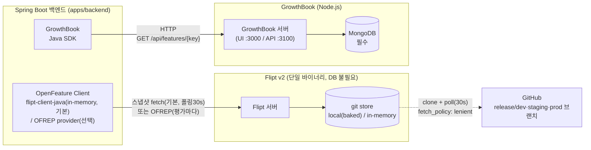
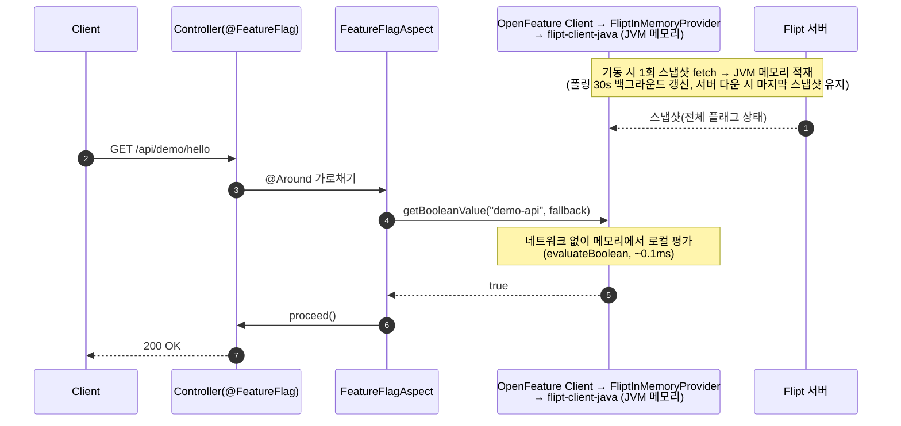
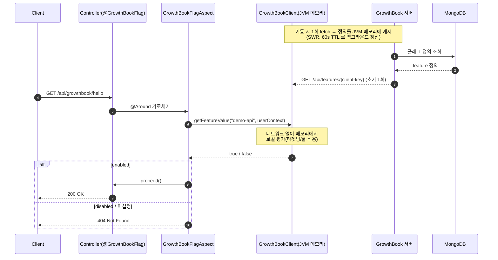
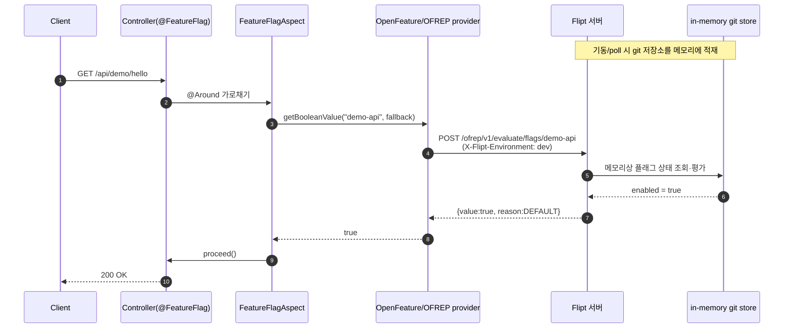
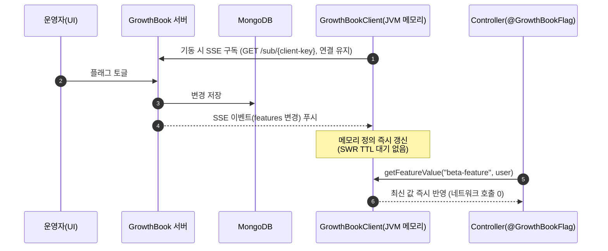
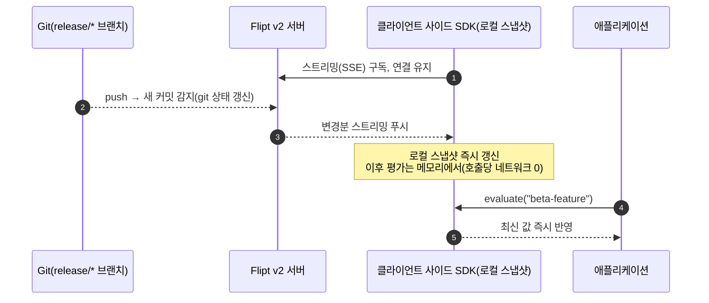

# Flipt vs GrowthBook 비교

이 문서는 본 레포(`flipt-demo`)에서 **같은 Spring Boot 백엔드**에 두 피처 플래그 솔루션을
나란히 붙여 비교한 결과를 정리한 것입니다. 동일한 플래그 키(`demo-api`, `beta-feature`)를
- **Flipt v2** — OpenFeature `Client`로 평가. **기본 in-memory(`flipt-client-java`)**, `flipt.mode=ofrep`로 OFREP 전환 가능 (`/api/demo/*`)
- **GrowthBook** — 네이티브 Java SDK 로 평가 (`/api/growthbook/*`)

로 1:1 대응시켜 운영 인프라·기능·실제 동작을 비교합니다.

> **Flipt 평가 방식**: 이 데모는 Flipt를 **클라이언트 사이드 in-memory 평가(`flipt-client-java`)로
> 통합 구현**했습니다(기본값). OpenFeature 추상화는 그대로 유지하므로, `flipt.mode=ofrep` 한 줄로
> **OFREP(서버 사이드) 평가로도 전환**할 수 있습니다. 둘 다 같은 `@FeatureFlag`/OpenFeature
> `Client`를 사용합니다.

> 검증 환경: Flipt `v2`, GrowthBook `growthbook/growthbook:latest`(+ MongoDB 7),
> 백엔드 Spring Boot 3.5.x / Java 25, OpenFeature SDK 1.20.2,
> Flipt 평가 = `flipt-client-java` 1.3.1(in-memory, 기본) / OFREP provider 0.0.1(선택),
> growthbook-sdk-java 0.10.6. (검증일: 2026-05-27)

## 한눈에 보기

| 항목 | Flipt v2 | GrowthBook |
| --- | --- | --- |
| 핵심 포지셔닝 | Git-native 피처 플래그 관리 | 피처 플래그 + 실험(A/B) + 제품 분석 |
| 상태 저장소 | **Git** (로컬/원격 브랜치, DB 불필요) | **MongoDB** (필수) |
| 형상 관리(SSOT) | git 선언형 YAML (GitOps 네이티브) | UI → MongoDB (git 연동 없음) |
| 평가 위치(본 데모 연동) | **클라이언트 사이드 in-memory**(기본, `flipt-client-java`) · OFREP(서버 사이드)도 `flipt.mode`로 선택 | **클라이언트 사이드** (SDK가 JVM 메모리에서 평가) |
| 지원 평가 모델 | 서버 사이드(REST/gRPC/OFREP) **+ 클라이언트 사이드 in-memory**(Java 등 client-side SDK) | 서버 사이드(remote eval) **+ 클라이언트 사이드 in-memory**(네이티브 SDK) |
| 외부 의존성 | 없음(단일 바이너리). 원격 환경만 GitHub | MongoDB 상시 필요 |
| 표준 프로토콜 | OpenFeature / OFREP 지원 | 네이티브 SDK 중심(24종) |
| 실험/통계 엔진 | 없음(플래그 관리에 집중) | 강력(Bayesian/Sequential/CUPED/Bandit 등) |
| 라이선스 | OSS(코어) + Pro(유료 기능) | OSS(MIT 계열) + Cloud(유료) |
| 초기 셋업 난이도 | 낮음(파일만 있으면 바로 평가) | 중간(계정·Feature·SDK Connection·키 발급 필요) |

---

# 운영 인프라

## 의존 구성도 (component diagram)

핵심 차이는 **상태를 어디에 저장하느냐**입니다. Flipt는 git(파일)을 그대로 단일 소스로
쓰므로 별도 DB가 없고, GrowthBook은 모든 상태(플래그·SDK Connection·계정)를 MongoDB에
저장하므로 MongoDB가 하드 의존성입니다.



- **Flipt** — 외부 서비스/DB 의존 없음. `local` 환경은 이미지에 baked된 로컬 git 저장소를,
  `dev/staging/prod` 는 GitHub 의 `release/*` 브랜치를 **in-memory 로 clone** 해 30초 주기로
  poll 합니다(`fetch_policy: lenient` → GitHub 불가 시에도 부팅).
- **GrowthBook** — MongoDB가 단일 상태 저장소(플래그·SDK Connection·사용자·실험 결과 메타).
  MongoDB가 없으면 GrowthBook 서버 자체가 동작하지 않습니다.

## API 요청 시 in-memory 평가 처리 과정 (sequence diagram)

두 솔루션 모두 "메모리에 적재한 플래그로 평가"하며, **이 데모는 Flipt·GrowthBook 둘 다
클라이언트 사이드 in-memory 평가로 통합 구현**되어 있습니다.

> 본 데모 기본 동기화 전략 — Flipt는 `flipt-client-java`로 스냅샷을 받아 **JVM 메모리에서 로컬
> 평가**(폴링 30s), GrowthBook은 SWR 폴링(`STALE_WHILE_REVALIDATE`, 60s TTL). Flipt는
> `flipt.mode=ofrep`로 **OFREP(서버 사이드) 평가로 전환**할 수도 있습니다(맨 아래 대안 다이어그램).
> 두 솔루션이 추가로 지원하는 **SSE 기반 실시간 푸시**는 "(보강) SSE 기반 실시간 동기화" 절 참고.

### Flipt (기본) — 클라이언트 사이드 in-memory 평가 (스냅샷 fetch 후 JVM 메모리에서 로컬 평가)



### GrowthBook — 클라이언트 사이드 평가 (SDK가 정의를 JVM 메모리에 캐시 후 로컬 평가)



### Flipt (선택) — OFREP 서버 사이드 평가 (`flipt.mode=ofrep`)

`flipt.mode=ofrep`로 전환하면 OpenFeature OFREP provider가 평가마다 Flipt 서버를 호출합니다.
in-memory 모드와 **동일한 `@FeatureFlag`/OpenFeature `Client`** 를 쓰고 provider만 교체됩니다.



**요지**
- **Flipt in-memory(기본)** · **GrowthBook 네이티브 SDK**: 둘 다 스냅샷/정의를 한 번 받아
  **JVM 메모리에서 로컬 평가** → 호출당 네트워크 0, 지연 거의 없음(~0.1ms). 갱신은 폴링 주기만큼
  지연(Flipt 30s / GrowthBook SWR 60s)되며, **서버가 잠시 끊겨도 마지막 스냅샷으로 평가가 지속**됩니다.
- **Flipt OFREP(선택)**: 평가마다 Flipt 서버로 HTTP 호출 → 서버가 평가. 최신성↑, 호출당 네트워크
  비용 존재. OpenFeature 표준(OFREP) 호환을 그대로 쓰고 싶을 때 적합.

> 📌 **두 솔루션 모두 서버 사이드 + 클라이언트 사이드 in-memory 평가를 지원**합니다. 이 데모는
> Flipt를 in-memory(`flipt-client-java`, Rust 코어 FFI)로 **통합 구현**해 GrowthBook과 같은 평가
> 모델로 맞췄고, OpenFeature 추상화(`FliptInMemoryProvider`)를 유지한 덕분에 `flipt.mode=ofrep`
> 한 줄로 서버 사이드(OFREP) 평가로도 즉시 전환됩니다.

### (보강) SSE 기반 실시간 동기화 — 두 솔루션 모두 지원 (현재 데모는 미적용)

위 두 다이어그램은 **변경 → 반영**에 약간의 지연이 있습니다. Flipt 원격 환경은 `poll_interval`(30s),
GrowthBook SDK는 SWR TTL(60s) 동안 stale 값을 쓸 수 있습니다. 두 솔루션 모두 이 지연을 없애는
**SSE(Server-Sent Events) 푸시 동기화**를 지원합니다 — 백엔드가 서버와 **연결을 유지**하다가
변경이 생기면 **즉시 푸시**받아 메모리 상태를 갱신합니다.

> ⚠️ **본 데모는 SSE를 사용하지 않습니다.** 아래는 두 솔루션이 지원하는 기능/프로덕션 패턴이며,
> 켜는 방법은 각 다이어그램 뒤에 정리했습니다.

**GrowthBook — SDK가 SSE 구독 → 변경 즉시 메모리 갱신**



> **켜는 법(한 줄 변경)**: `GrowthBookConfig` 의 `refreshStrategy` 를
> `STALE_WHILE_REVALIDATE` → `SERVER_SENT_EVENTS` 로 변경. growthbook-sdk-java 0.10.6 에
> `FeatureRefreshStrategy.SERVER_SENT_EVENTS` 전략과 SSE 리스너(`GBEventSourceListener`)가
> 포함돼 있어 추가 의존성 없이 전환 가능. (서버의 SSE 활성화 필요)

**Flipt — 클라이언트 사이드 SDK가 스트리밍 구독 → 변경 즉시 스냅샷 갱신**



> **켜는 법(한 줄 변경)**: 본 데모는 이미 Flipt를 client-side SDK(`flipt-client-java`)로 in-memory
> 평가하므로, `flipt.sync-mode=streaming`(→ `FetchMode.STREAMING`)으로 바꾸면 폴링 대신 SSE
> 스트리밍으로 즉시 동기화됩니다. 기본값은 폴링(30s)입니다. (`flipt.mode=ofrep`일 때는 OFREP가
> 요청/응답이라 해당 없음.)

**SSE 도입 시 트레이드오프**

| 측면 | 폴링/요청응답(현재 데모) | SSE 푸시 |
| --- | --- | --- |
| 반영 지연 | poll/TTL 만큼(수십 초) | 사실상 즉시(sub-second) |
| 호출당 네트워크 | Flipt OFREP는 평가마다 발생 | 0(연결 유지 + 메모리 평가) |
| 운영 복잡도 | 낮음(상태 비유지) | 연결 유지·재연결·프록시/LB의 SSE 지원 고려 필요 |
| 적합 상황 | 단순/소규모, 지연 허용 | 즉시 롤아웃/킬스위치가 중요한 운영 |

---

# 지원하는 기능 및 장단점

## 기능 비교

| 기능 | Flipt v2 | GrowthBook |
| --- | --- | --- |
| Boolean / Multivariate 플래그 | ✅ | ✅ |
| 세그먼트/타겟팅 룰 | ✅ | ✅ (속성 기반 타겟팅 풍부) |
| 퍼센트 롤아웃(점진 배포) | ✅ | ✅ |
| A/B 테스트·실험 | ❌ (플래그 관리 집중) | ✅ (원클릭으로 플래그→실험) |
| 통계 엔진 | ❌ | ✅ Bayesian/Sequential/CUPED/Bandit/SRM |
| 제품 분석 | ❌ | ✅ |
| OpenFeature 표준 | ✅ (OFREP 네이티브) | △ (provider 별도) |
| SDK | 다수 + OFREP로 표준화 | 24종(React/Python/iOS/Android/Java 등) |
| GitOps / 선언형 config | ✅ **네이티브(git이 SSOT)** | ❌ (UI→MongoDB) |
| 감사 로그/변경 이력 | ✅ git 히스토리 그대로(+Pro audit) | ✅ 앱 내 audit log |
| 승급(promotion) 워크플로 | ✅ 브랜치 승급(dev→staging→prod) | △ 환경별 관리(별도) |
| 외부 DB 필요 | ❌ | ✅ MongoDB |
| 실시간 갱신 | ✅ streaming API(v2) / poll | ✅ SSE 스트리밍 / SWR |
| 데이터 웨어하우스 연동 | ❌ | ✅ (실험 분석용) |

## Flipt 장단점

**장점**
- **Git-native**: 플래그가 코드처럼 PR·리뷰·`git revert` 롤백·브랜치 승급으로 관리됨. 변경 이력이 git에 그대로 남아 감사 추적이 자연스러움.
- **외부 의존성 없음**: 단일 바이너리, DB 불필요 → 운영 단순, 에어갭/온프레미스 친화적.
- **OpenFeature(OFREP) 네이티브**: 벤더 종속을 줄이고 표준 SDK로 교체 용이.
- **GitOps 적합**: 환경별 브랜치 매핑 + poll 자동 반영(재시작 불필요), 읽기전용 운영으로 안전.

**단점**
- 실험/통계 엔진·제품 분석이 **없음**(순수 플래그 관리). A/B 테스트는 별도 도구 필요.
- 일부 고급 기능(merge proposals, secret 매니저 연동, audit 강화 등)은 **Pro(유료)**.
- 비개발 직군이 git 워크플로(브랜치/PR)에 익숙하지 않으면 진입장벽.

## GrowthBook 장단점

**장점**
- **올인원**: 피처 플래그 + 실험(A/B) + 통계 분석 + 제품 분석을 한 플랫폼에서. 플래그를 원클릭으로 실험으로 전환.
- **강력한 통계 엔진**: Bayesian/Sequential/CUPED/Bandit/SRM 등 실험 신뢰성 기능 풍부.
- **SDK 생태계 넓음(24종)**, 클라이언트 사이드 로컬 평가로 평가 지연 거의 없음.
- 데이터 웨어하우스(BigQuery, Snowflake 등) 직접 연동해 자체 데이터로 분석.

**단점**
- **MongoDB 필수** → 운영 구성요소·백업·가용성 부담 증가.
- **Git-native가 아님**: 플래그 정의가 UI→MongoDB에 갇혀 코드 리뷰/GitOps 흐름과 분리됨(IaC로 별도 관리 필요).
- 초기 셋업이 번거로움: 계정·조직·Feature·SDK Connection·클라이언트 키 발급 후 주입 필요(본 데모의 404 원인, 아래 테스트 결과 참고).
- 플래그만 필요한 팀에는 기능 과잉(운영/학습 비용).

## 커뮤니티 활성도 (GitHub 등)

| 지표 | Flipt (`flipt-io/flipt`) | GrowthBook (`growthbook/growthbook`) |
| --- | --- | --- |
| GitHub Stars | 약 4.6k+ | 약 7.5k+ |
| 기여자 | 활발(2~3주 주기 릴리스) | 180+ contributors, 정기 릴리스 |
| 라이선스 모델 | OSS 코어 + Pro/Cloud | OSS(MIT 계열) + Cloud |
| 지원 채널 | GitHub, Discord, 공식 블로그/문서 | GitHub, Slack, 공식 문서, YC 백업 |
| 특징 | 표준(OpenFeature) 진영에서 인지도↑ | 실험 플랫폼으로서 커뮤니티·고객 사례 많음 |

> 별 수치는 시점에 따라 변동하므로 대략치입니다. 전반적으로 **GrowthBook이 스타·기여자 규모가
> 더 크고**(실험 플랫폼 수요), **Flipt는 git-native/OpenFeature 표준** 축에서 입지를 굳히고 있습니다.

## 사용 사례 (유명 회사 포함)

**GrowthBook** — 공개된 대형 고객 사례가 풍부합니다.
- **Dropbox** — AI 제품 개발에 활용, 하루 30억 건 피처 평가.
- **Breeze Airways** — 월 100만 달러+ 증분 매출.
- **TodayTix** — 페이지뷰 24% 상승, **Khan Academy** — A/B 테스트 처리량 5배,
  **Oda** — 실험 400+ 건, **Lingokids**, **Floward** 등. (전체 약 3,000개 기업, 월 1,000억+ 이벤트 조회)

**Flipt** — git-native/self-host 성향상 공개 사례는 상대적으로 적지만 실사용 보고가 있습니다.
- **Money Forward** — Ruby on Rails 앱에 Flipt 기반 회복탄력적 플래그 래퍼 구축(기술 블로그).
- **MilMove**(美 정부/TRANSCOM 프로젝트) — ADR로 Flipt 채택 공식 문서화.
- **Allocate** — self-host 가능·성능 중심 플래그 플랫폼으로 제품 전반 제어에 활용.

> 경향: **실험·분석이 중심이면 GrowthBook**(상용 도입 사례 다수), **GitOps·self-host·표준
> 준수가 중심이면 Flipt**(정부/온프레미스/엔지니어링 주도 조직).

---

# 테스트 결과

본 레포에서 실제로 두 솔루션을 기동하고 동일 시나리오를 호출해 검증한 결과입니다.

## 1) 백엔드 단위/통합 테스트 — ✅ 8/8 통과

`./gradlew test --rerun-tasks` 결과 (BUILD SUCCESSFUL):

| 테스트 클래스 | tests | failures | errors | 검증 내용 |
| --- | --- | --- | --- | --- |
| `FeatureFlagAspectTest` | 2 | 0 | 0 | 플래그 ON→메서드 실행, OFF→`FeatureDisabledException` |
| `DemoControllerTest` | 3 | 0 | 0 | ON→200, OFF→404(`$.flag` 확인), `/api/health`는 항상 200 |
| `FliptInMemoryProviderTest` | 3 | 0 | 0 | in-memory provider가 SDK 결과 반영 + client 부재/예외 시 fallback |
| **합계** | **8** | **0** | **0** | |

## 2) Flipt 환경별 OFREP 평가 — ✅ 의도대로 분기

`beta-feature` 를 환경별로 평가(`X-Flipt-Environment` 헤더). `local/dev`는 ON, `staging/prod`는 OFF:

```
local:   {"key":"beta-feature","reason":"DEFAULT","variant":"true","value":true}
dev:     {"key":"beta-feature","reason":"DEFAULT","variant":"true","value":true}
staging: {"key":"beta-feature","reason":"DEFAULT","variant":"false","value":false}
prod:    {"key":"beta-feature","reason":"DEFAULT","variant":"false","value":false}
```

→ `release/staging`·`release/prod` 브랜치의 선언형 YAML 차이가 그대로 평가에 반영됨(GitOps 동작 확인).

## 3) 라이브 엔드포인트 비교 (Flipt vs GrowthBook)

같은 백엔드, 같은 플래그 키로 1:1 호출:

| 시나리오 | Flipt 엔드포인트 | 결과 | GrowthBook 엔드포인트 | 결과 |
| --- | --- | --- | --- | --- |
| 기본 API(`demo-api`) | `GET /api/demo/hello` | **200** | `GET /api/growthbook/hello` | **404** |
| 베타(`beta-feature`) | `GET /api/demo/beta` | **200** | `GET /api/growthbook/beta` | **404** |
| 대조군(게이팅 없음) | `GET /api/health` | **200** | `GET /api/growthbook/health` | **200** |

Flipt 응답 예:
```
demo/hello: HTTP 200 {"environment":"dev","message":"Hello from the demo API!"}
```
GrowthBook 응답 예:
```
growthbook/hello: HTTP 404 {"flag":"demo-api","status":404,"error":"Not Found",...}
```

## 4) 핵심 차이를 드러낸 결과 — "셋업 비용"

GrowthBook 엔드포인트가 404가 된 이유는 버그가 아니라 **두 솔루션의 운영 모델 차이**입니다.

- **Flipt**: 레포의 git 선언형 YAML(`config/<env>/features.yaml`)만 있으면 **추가 셋업 없이 바로
  평가**됨 → `demo-api`/`beta-feature` 가 git에 `enabled: true` 라서 200.
- **GrowthBook**: 플래그 정의가 git에 없고 **UI에서 생성 → MongoDB 저장 → SDK Connection 키
  발급 → `.env` 주입**까지 해야 평가 가능. 본 검증 시 `GROWTHBOOK_CLIENT_KEY` 가 비어 있어
  SDK가 정의를 못 받아 평가가 fallback(off) → 404.

백엔드 로그에서 그대로 확인됨:
```
WARN  GrowthBookConfig : GrowthBook client key not configured (GROWTHBOOK_CLIENT_KEY is empty)
      — GrowthBook evaluations will fall back to off ...
ERROR FeatureEvaluator : ... EvaluationContext.getGlobal() is null (정의 미적재 → 로컬 평가 불가)
```

→ **Flipt는 "git에 있으면 즉시 동작"**, **GrowthBook은 "사전 셋업(계정·Feature·키)이 필수"**.
이 차이가 본 데모에서 가장 분명하게 드러난 운영상 트레이드오프입니다.
(키를 발급해 `.env`에 주입하면 GrowthBook도 동일하게 200/404로 게이팅됨 — README "GrowthBook 셋업" 참고.)

## 5) Flipt in-memory 평가 검증 — ✅ 통합 구현 동작 + OFREP 전환 가능

데모를 `flipt-client-java`(client-side, in-memory) 기본으로 전환한 뒤 실제로 검증한 결과입니다.

**(a) 기본 in-memory 모드로 기동** — 기동 로그가 모드를 명시:
```
INFO OpenFeatureConfig : Flipt evaluation mode=in-memory (client-side; url=http://flipt:8080,
     environment=dev, namespace=default, sync=polling, interval=30s)
```
→ `/api/demo/hello`·`/api/demo/beta`·`/api/health` 모두 **200**.

**(b) in-memory의 결정적 특성 — 서버가 죽어도 평가 지속** (OFREP라면 실패할 시나리오):
```
$ docker compose stop flipt          # Flipt 서버 중지
$ curl .../api/demo/hello  → HTTP 200 {"message":"Hello from the demo API!", ...}
$ curl .../api/demo/beta   → HTTP 200 {"message":"You are seeing the beta feature.", ...}
```
→ 기동 시 받아둔 **스냅샷을 JVM 메모리에서 평가**하므로 서버 다운 중에도 동작(폴링만 실패).
이것이 OFREP(평가마다 서버 호출)와 구분되는 client-side in-memory의 본질.

**(c) OFREP 모드 회귀 — `flipt.mode=ofrep`로 전환** (provider만 교체, 코드/엔드포인트 불변):
```
INFO OpenFeatureConfig : Flipt evaluation mode=ofrep (server-side; url=..., environment=dev, ...)
```
→ 동일 엔드포인트 정상 **200**. in-memory ↔ ofrep 전환 확인.

**(d) Docker 풀스택** — `eclipse-temurin:25-jre`(glibc) 컨테이너에서 Rust 네이티브 엔진
(`libfliptengine.so`) 로드 정상(`UnsatisfiedLinkError` 없음), `--enable-native-access`로 JDK 25
경고도 제거, in-memory 평가 동작 확인.

---

# 결론 / 선택 가이드

| 상황 | 추천 |
| --- | --- |
| GitOps·IaC·코드리뷰로 플래그를 관리하고 싶다 | **Flipt** |
| DB 없이 단순하게, 에어갭/온프레미스 | **Flipt** |
| OpenFeature 표준으로 벤더 종속을 피하고 싶다 | **Flipt** |
| A/B 테스트·실험·통계 분석이 핵심이다 | **GrowthBook** |
| 플래그를 원클릭으로 실험까지 확장하고 싶다 | **GrowthBook** |
| 데이터 웨어하우스 기반 제품 분석이 필요하다 | **GrowthBook** |

**한 줄 요약** — Flipt는 *git-native·표준 준수·운영 단순함*에 강하고(순수 플래그 관리),
GrowthBook은 *실험·통계·분석을 아우르는 올인원*에 강합니다(대신 MongoDB와 셋업 비용). 두
솔루션은 경쟁이라기보다 **"플래그만 vs 플래그+실험"** 이라는 다른 문제 영역에 최적화돼 있습니다.

## 참고 자료
- [flipt-io/flipt (GitHub)](https://github.com/flipt-io/flipt) · [Flipt 공식](https://www.flipt.io/) · [Flipt v2 문서](https://docs.flipt.io/v2/introduction)
- [growthbook/growthbook (GitHub)](https://github.com/growthbook/growthbook) · [GrowthBook 공식](https://www.growthbook.io/) · [GrowthBook 고객 사례](https://www.growthbook.io/customers)
- [Money Forward — Flipt 적용 사례](https://global.moneyforward-dev.jp/2025/11/04/building-a-resilient-feature-flag-wrapper-in-ruby-on-rails-with-flipt/) · [MilMove ADR — Use Flipt](https://transcom.github.io/mymove-docs/docs/adrs/use-flipt-feature-flags/)
- [OSS 피처 플래그 도구 비교(Unleash/GrowthBook/Flipt/Flagsmith)](https://flagshark.com/blog/open-source-feature-flag-tools-compared-2026/)
